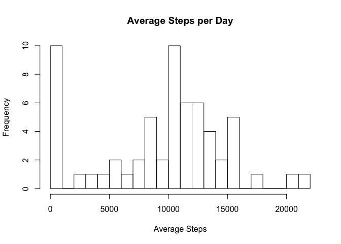
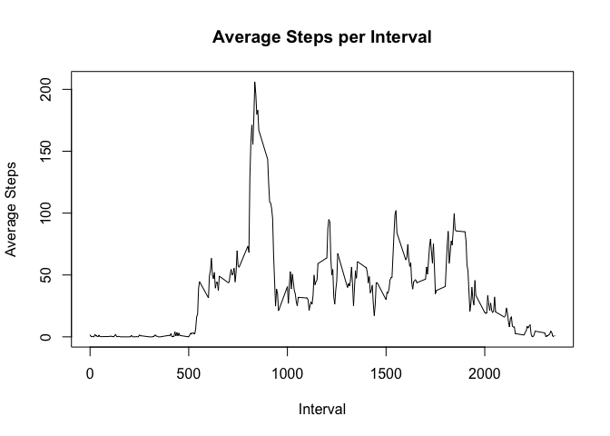
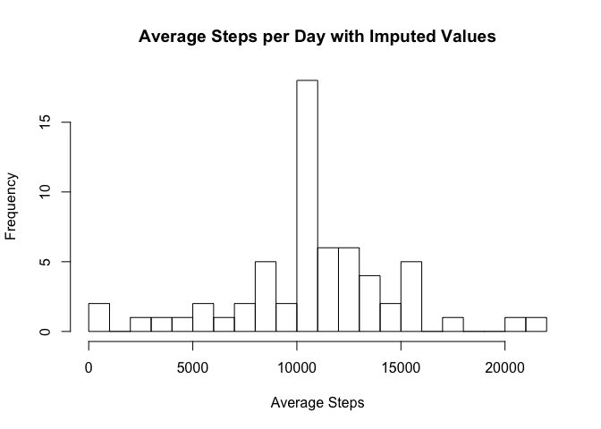
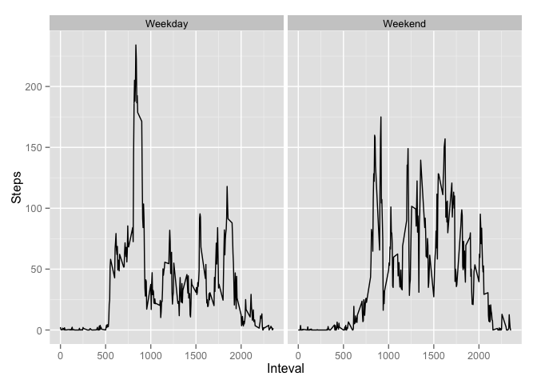

# Reproducible Research: Peer Assessment 1


## Loading and preprocessing the data

```r
unzip("activity.zip")
fitdata <- read.csv("activity.csv")
fitdata$date <- as.Date(fitdata$date)
```

## What is mean total number of steps taken per day?  

```r
agg <- aggregate(fitdata$steps,list(fitdata$date),sum, na.rm=TRUE)
hist(agg[,2],breaks=30,xlab="Average Steps",main="Average Steps per Day")
```

 


Mean steps per day  

```r
 mean(agg[,2],na.rm=TRUE)
```

```
## [1] 9354
```
Median steps per day  

```r
median(agg[,2],na.rm=TRUE)
```

```
## [1] 10395
```

## What is the average daily activity pattern?

```r
agg <- aggregate(fitdata$steps,list(fitdata$interval),mean, na.rm=TRUE)
#agg[2] <- agg[2]/length(unique(fitdata$date))
plot(agg,type="l",ylab="Average Steps",xlab="Interval",main="Average Steps per Interval")
```

 

Maximum steps in a 5 minute interval:

```r
agg[which.max(agg[,2]),1]
```

```
## [1] 835
```

## Imputing missing values


Number of missing data elements:

```r
fitdatana <- which(is.na(fitdata))
length(fitdatana)
```

```
## [1] 2304
```


Replacing NA with rounded average steps per interval:  


```r
imputedata <- fitdata
for (fitindex in 1:length(fitdatana))
{
    interval <- imputedata[fitdatana[fitindex],]$interval
    imputedata[fitdatana[fitindex],]$steps <- round(agg[agg$Group.1 ==interval,]$x)
}
imputeagg <- aggregate(imputedata$steps,list(imputedata$date),sum, na.rm=TRUE)
```

Display histogram, mean, and median of imputed data, as well as length of remaining NAs to demonstrate replacement:


```r
hist(imputeagg[,2],breaks=30,xlab="Average Steps",main="Average Steps per Day with Imputed Values")
```

 

```r
 mean(imputeagg[,2],na.rm=TRUE)
```

```
## [1] 10766
```

```r
median(imputeagg[,2],na.rm=TRUE)
```

```
## [1] 10762
```

```r
length(which(is.na(imputedata)))
```

```
## [1] 0
```

## Are there differences in activity patterns between weekdays and weekends?

Weekdays show a consistent wakeup time, where as weekends show more variety in time of activity startint

```r
library(ggplot2)
fitdata$weekpart <- sub("^[^S].*", "Weekday", weekdays((fitdata$date)))
fitdata$weekpart <- sub("^S.*", "Weekend", fitdata$weekpart)
agg <- aggregate(fitdata$steps,list(fitdata$interval,fitdata$weekpart),mean, na.rm=TRUE)
agg$Group.2 <- factor(agg$Group.2)
qplot(Group.1, y = x, data=agg, facets= ~Group.2, geom="line",xlab="Inteval",ylab="Steps")
```

 
